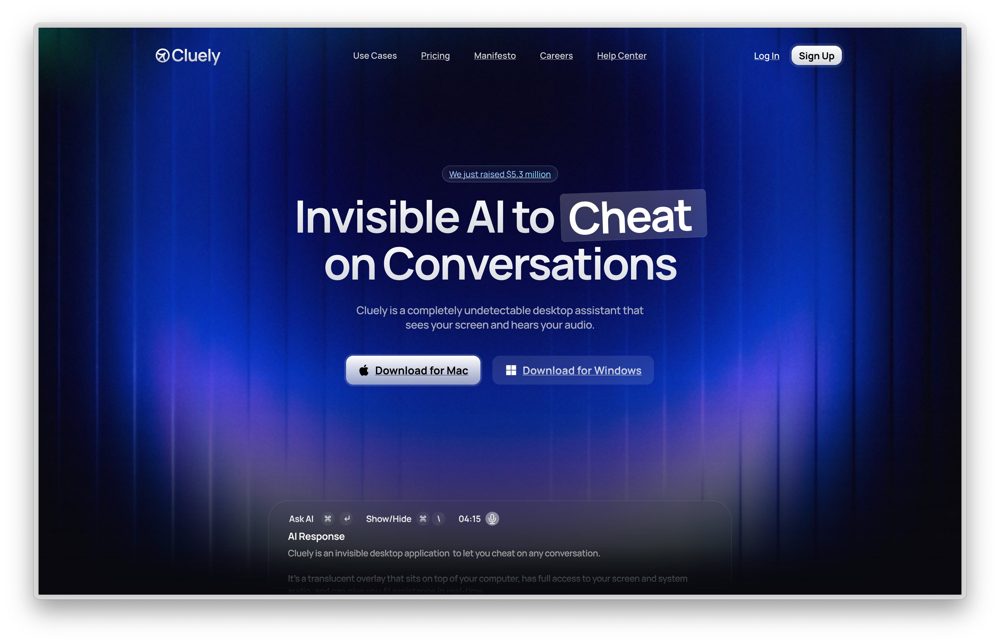
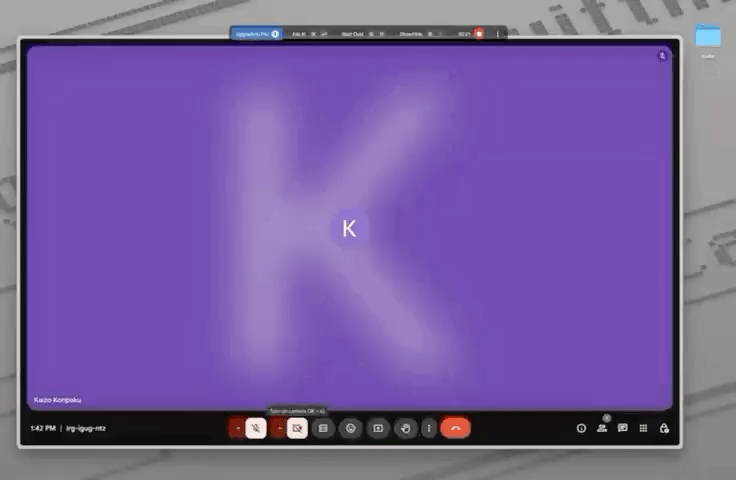
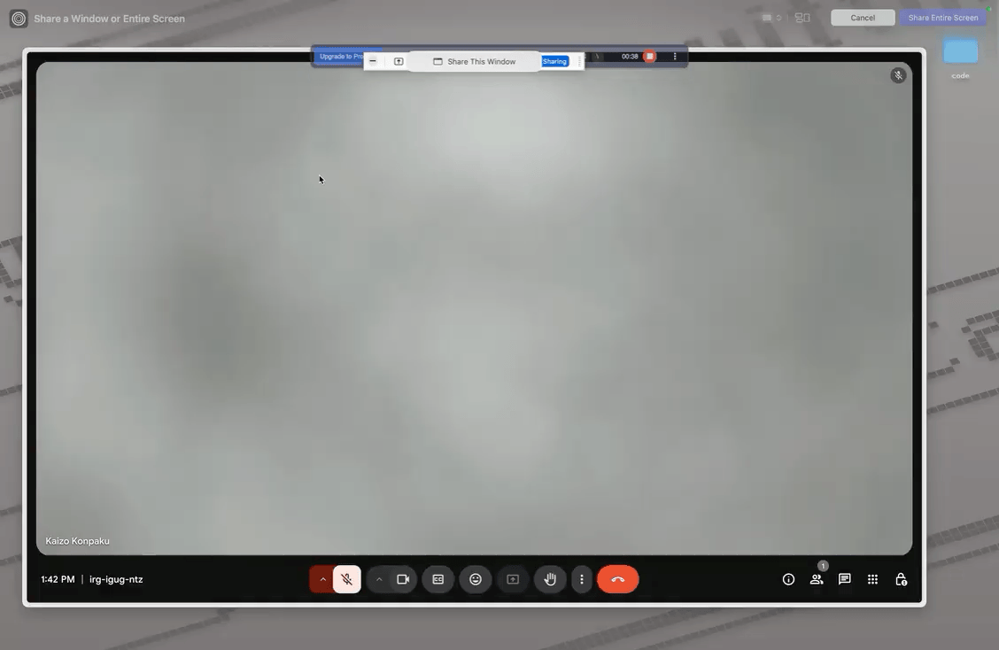
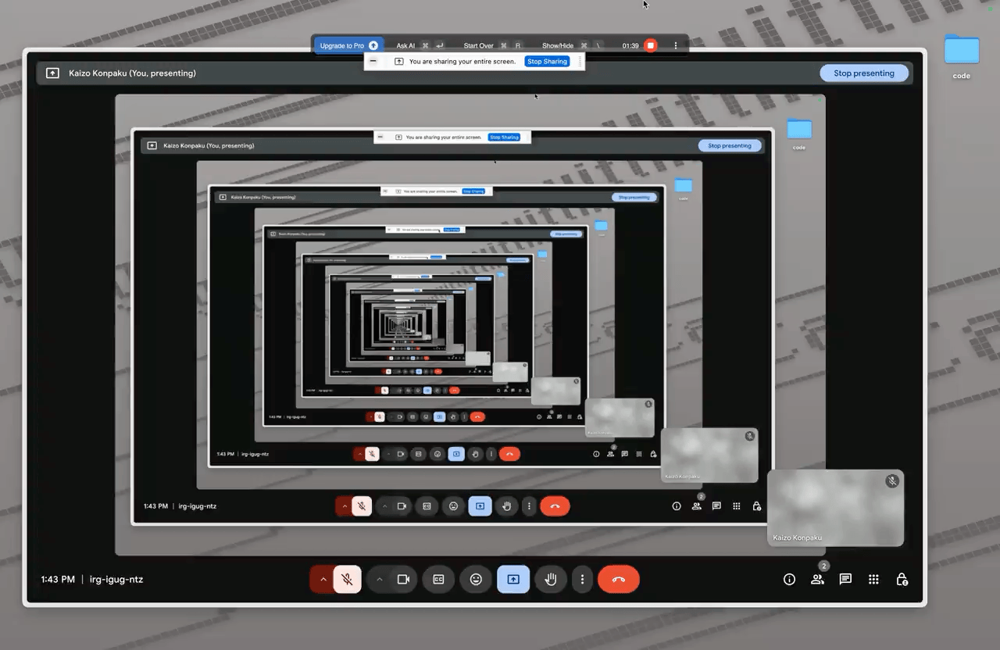
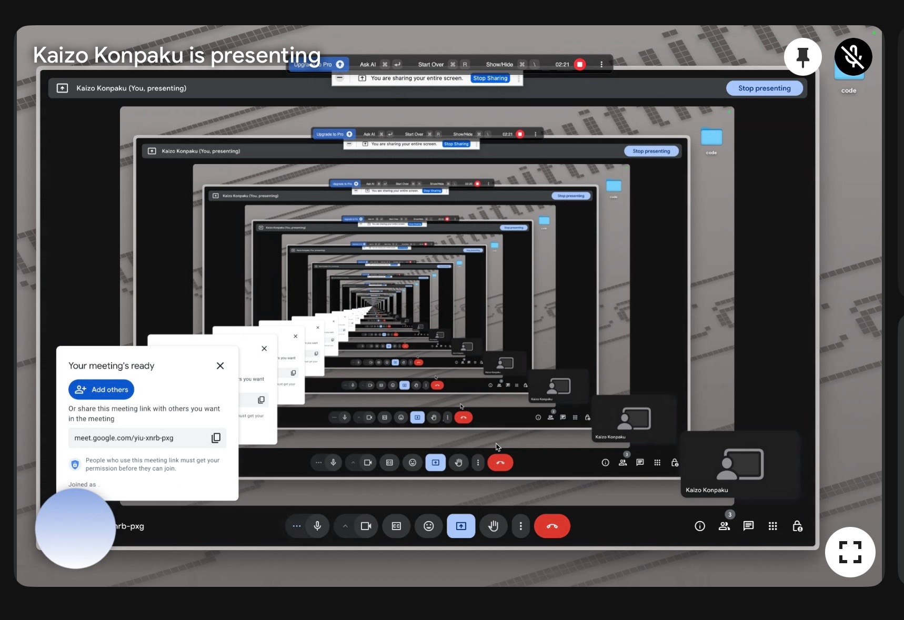

# ⚠️ IMPORTANT WARNING

**This document is for interviewers and candidates to understand that apps like Cluely, InterviewCoder, and similar "AI interview assistant" tools are NOT completely invisible during interviews.** Despite claims of being "undetectable" or "completely hidden," these apps can be easily detected through standard interview practices.

## Who Uses These Apps?

- Candidates who believe these tools are undetectable
- People who think they can get away with using AI assistance during interviews
- Those who are misled by marketing claims of "invisibility"

## The Reality

These apps claim to be "completely invisible" or "undetectable," but as this document demonstrates, they are easily visible to interviewers through standard screen sharing and video features. Using such tools during interviews is risky and can lead to immediate disqualification.

---

# Screen Sharing and Interview Transparency

When conducting interviews using common video conferencing platforms like Zoom, Google Meet, Microsoft Teams, or Amazon Chime, interviewers can verify candidates' activity during screen sharing sessions. This helps maintain transparency and integrity throughout the interview process.

## How Interviewers Can Detect Screen Activity

1. **Request Video On:**  
   Having the candidate's video enabled helps ensure they're actively participating.

   

2. **Ask for Screen Sharing:**  
   By having candidates share their screens, interviewers can observe their workspace and activities directly.

   

3. **Use Presenter Overlay Feature:**  
   On macOS, enabling the Presenter Overlay while video is on causes any shared window to appear prominently and can reveal which applications are active in the foreground.

   

   

### What This Means

- If a candidate is using applications like Cluely or InterviewCoder during an interview, the Presenter Overlay and screen sharing will make it clear to the interviewer that these apps are active.
- This transparency helps ensure candidates are engaging honestly and using permitted resources.

## Notes

- The Presenter Overlay feature can detect and highlight shared windows even if turned on before or after an app is launched.
- This behavior is a built-in macOS feature and contributes to fair interview practices.

## Conclusion

Interviewers can leverage built-in video conferencing and macOS features to maintain interview integrity without relying solely on third-party apps. Candidates are encouraged to be transparent and prepared, as honest communication and skill are the best ways to succeed.